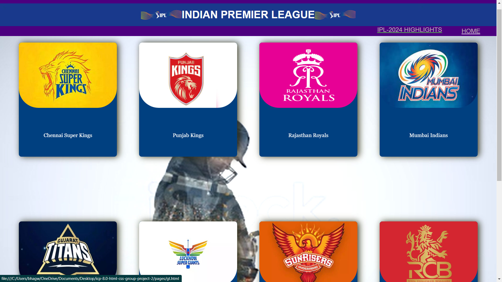

# Hi! I'm happy to see you here! 

## ICP-8.0-HTML-CSS-GROUP-PROJECT-2
### INDIAN PREMIER LEAGUE(IPL)  
<strong>About Project :</strong>
- 🔭 This project involves creating a website dedicated to the Indian Premier League (IPL) using HTML and CSS.
- 🔭 It is a group project where each contributor has developed their own web pages.
- 🔭 The web pages provide detailed information about various IPL teams, including:
1. Chennai Super Kings (CSK)
2. Mumbai Indians (MI)
3. Royal Challengers Bangalore (RCB)
4. Lucknow Super Giants (LSG)
5. Rajasthan Royals (RR)
6. Punjab Kings (PBKS)
7. Gujarat Titans(GT)
8. Sunrisers Hyderabad(SRH)

- 🔭 I have created the home page for this website.
- 🔭 On the home page, all the team details are presented as individual cards.
- 🔭 Each card can be clicked to access more detailed information about the respective team.
## Website

Link :https://iplmiracle611.netlify.app

### CONTRIBUTORS : 

### <u> Support :</u>

If you find my projects helpful or interesting, consider giving them a . It means a lot to me!